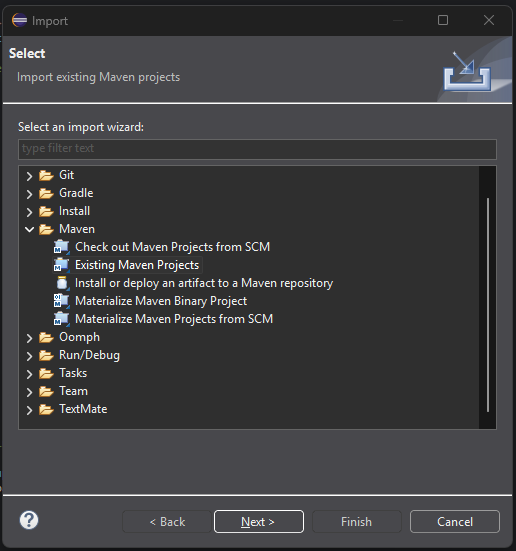
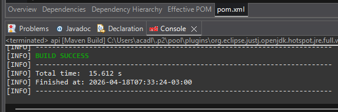
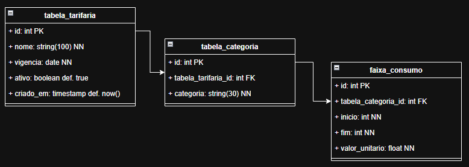

# 💧 AquaTariff — API de Tabela Tarifária de Água

API REST desenvolvida em Java com Spring Boot para gerenciamento e cálculo de tarifas de água. O sistema suporta múltiplas categorias de consumidores com cálculo progressivo por faixas de consumo, totalmente parametrizável via banco de dados PostgreSQL.

---

## 🛠️ Stack Tecnológica

- **Linguagem:** Java 21
- **Framework:** Spring Boot 3.4.4
- **Banco de Dados:** PostgreSQL
- **ORM:** Hibernate / JPA
- **Build:** Maven
- **IDE:** Eclipse

---

## ✅ Pré-requisitos

- Java 21+
- Maven 3.8+
- PostgreSQL 18+

---

## ⚙️ Configuração do Banco de Dados

1. Crie um banco de dados no PostgreSQL:

```sql
CREATE DATABASE aquatariff;
```

2. As tabelas são criadas automaticamente pelo Hibernate ao iniciar a aplicação com a configuração:

```properties
spring.jpa.hibernate.ddl-auto=update
```

Ou, se preferir, execute manualmente o script disponível em `sql/schema.sql`.

---

## 🚀 Instalação e Execução

1. Clone o repositório:

```bash
git clone https://github.com/acadl/acqua-tariff.git
cd acqua-tariff
```

2. Configure o `application.properties` em `src/main/resources/`:

```properties
spring.application.name=acqua-tariff

# PostgreSQL
spring.datasource.url=jdbc:postgresql://localhost:5432/NOME_BANCO_AQUI
spring.datasource.driver-class-name=org.postgresql.Driver
spring.datasource.username=postgres
spring.datasource.password=SENHA_AQUI

# JPA
spring.jpa.database-platform=org.hibernate.dialect.PostgreSQLDialect
spring.jpa.hibernate.ddl-auto=update
spring.jpa.show-sql=true
spring.jpa.open-in-view=false
```


3. Como abrir e executar no Eclipse:

1. Abra o Eclipse
2. Vá em **File** → **Import** → **Maven** → **Existing Maven Projects** e clique em **Next**
3. Clique em **Browse**, navegue até o diretório onde está o arquivo `pom.xml` do projeto e clique em **Finish**
4. Aguarde o Eclipse carregar e baixar todas as dependências do projeto automaticamente
5. Clique com o botão direito na raiz do projeto → **Run As** → **Maven Build**
   - No campo **Goals** digite: `clean install`
   - Clique em **Run**
   - Aguarde a mensagem `BUILD SUCCESS` no console

   
   *Figura 1: Selecione projetos Maven existentes*

   
   *Figura 2: Mensagem de sucesso após o Maven Build*

6. Clique com o botão direito na raiz do projeto → **Run As** → **Java Application**
7. Aguarde a mensagem no console:
   ```
   Started ApiApplication in X seconds
   ```
 
8. A aplicação estará disponível em `http://localhost:8080`
> ⚠️ **Importante:** Ao iniciar a aplicação pela primeira vez, o Hibernate criará automaticamente todas as tabelas necessárias no banco de dados PostgreSQL configurado no `application.properties`.
 
---

## 📁 Estrutura do Projeto

```
src/main/java/br/com/acqua_tariff/api/
├── controller/
│   ├── TabelaTarifariaController.java
│   ├── GlobalExceptionHandler.java
│   └── CalculoController.java
├── model/
│   ├── domain/
│   │   ├── TabelaTarifaria.java
│   │   ├── TabelaCategoria.java
│   │   ├── FaixaConsumo.java
│   │   └── CategoriaEnum.java
│   ├── dto/
│   │   ├── CalculoRequestDTO.java
│   │   ├── CalculoResponseDTO.java
│   │   ├── DetalhamentoDTO.java
│   │   └── FaixaDTO.java
│   ├── repository/
│   │   └── TabelaTarifariaRepository.java
│   └── service/
│       ├── TabelaTarifariaService.java
│       └── CalculoService.java
│       └── FaixaConsumoValidator.java
```

---

## 🗄️ Modelagem de Dados

O sistema é composto por 3 tabelas relacionadas:


*Figura 3: Relacionamento das tabelas*

```
tabela_tarifaria
      │
      │ 1:N
      ▼
tabela_categoria  (ex: INDUSTRIAL da Tabela 2026)
      │
      │ 1:N
      ▼
faixa_consumo  (ex: 0-10m³ → R$ 1,00)
```

---

## 📡 Endpoints da API

### 1. Criar Tabela Tarifária

**`POST /api/tabelas-tarifarias`**

Request Body:

```json
{
  "nome": "Tabela Tarifária 2026",
  "vigencia": "2026-01-01",
  "categorias": [
    {
      "categoria": "INDUSTRIAL",
      "faixas": [
        { "inicio": 0, "fim": 10, "valorUnitario": 1.00 },
        { "inicio": 11, "fim": 20, "valorUnitario": 2.00 },
        { "inicio": 21, "fim": 30, "valorUnitario": 3.00 },
        { "inicio": 31, "fim": 99999, "valorUnitario": 4.00 }
      ]
    },
    {
      "categoria": "COMERCIAL",
      "faixas": [
        { "inicio": 0, "fim": 10, "valorUnitario": 1.50 },
        { "inicio": 11, "fim": 20, "valorUnitario": 2.50 },
        { "inicio": 21, "fim": 30, "valorUnitario": 3.50 },
        { "inicio": 31, "fim": 99999, "valorUnitario": 4.50 }
      ]
    },
    {
      "categoria": "PARTICULAR",
      "faixas": [
        { "inicio": 0, "fim": 10, "valorUnitario": 0.50 },
        { "inicio": 11, "fim": 20, "valorUnitario": 1.00 },
        { "inicio": 21, "fim": 30, "valorUnitario": 1.50 },
        { "inicio": 31, "fim": 99999, "valorUnitario": 2.00 }
      ]
    },
    {
      "categoria": "PUBLICO",
      "faixas": [
        { "inicio": 0, "fim": 10, "valorUnitario": 0.75 },
        { "inicio": 11, "fim": 20, "valorUnitario": 1.25 },
        { "inicio": 21, "fim": 30, "valorUnitario": 1.75 },
        { "inicio": 31, "fim": 99999, "valorUnitario": 2.25 }
      ]
    }
  ]
}
```

Response `201 Created`:

```json
{
  "id": 1,
  "nome": "Tabela Tarifária 2026",
  "vigencia": "2026-01-01",
  "ativo": true,
  "criadoEm": "2026-04-17T09:00:00",
  "categorias": [...]
}
```

---

### 2. Listar Tabelas Tarifárias

**`GET /api/tabelas-tarifarias`**

Retorna todas as tabelas ativas com suas categorias e faixas.

Response `200 OK`:

```json
[
  {
    "id": 1,
    "nome": "Tabela Tarifária 2026",
    "vigencia": "2026-01-01",
    "ativo": true,
    "categorias": [
      {
        "id": 1,
        "categoria": "INDUSTRIAL",
        "faixas": [
          { "id": 1, "inicio": 0, "fim": 10, "valorUnitario": 1.00 },
          { "id": 2, "inicio": 11, "fim": 20, "valorUnitario": 2.00 }
        ]
      }
    ]
  }
]
```

---

### 3. Excluir Tabela Tarifária

**`DELETE /api/tabelas-tarifarias/{id}`**

Realiza exclusão lógica da tabela, impedindo seu uso em cálculos futuros.

Response `204 No Content`

---

### 4. Calcular Valor a Pagar

**`POST /api/calculos`**

Request Body:

```json
{
  "categoria": "INDUSTRIAL",
  "consumo": 18
}
```

Response `200 OK`:

```json
{
  "categoria": "INDUSTRIAL",
  "consumoTotal": 18,
  "valorTotal": 26.00,
  "detalhamento": [
    {
      "faixa": { "inicio": 0, "fim": 10 },
      "m3Cobrados": 10,
      "valorUnitario": 1.00,
      "subtotal": 10.00
    },
    {
      "faixa": { "inicio": 11, "fim": 20 },
      "m3Cobrados": 8,
      "valorUnitario": 2.00,
      "subtotal": 16.00
    }
  ]
}
```

---

## 🧮 Regra de Cálculo

O cálculo é feito **progressivamente** por faixas:

```
Consumo em cada faixa × Valor unitário da faixa = Subtotal da faixa
```

Exemplo com INDUSTRIAL, 18m³:

| Faixa | m³ Cobrados | Valor Unitário | Subtotal |
|---|---|---|---|
| 0 a 10m³ | 10 | R$ 1,00 | R$ 10,00 |
| 11 a 20m³ | 8 | R$ 2,00 | R$ 16,00 |
| **Total** | **18** | | **R$ 26,00** |


Alterações no valor unitário realizadas no banco de dados são automaticamente refletidas nas requisições seguintes. 
---

## 🗃️ Scripts de Banco de Dados

Os scripts estão disponíveis na pasta `sql/`:

- `sql/schema.sql` — criação das tabelas
- `sql/seed.sql` — dados de exemplo

---

## 📋 Categorias Suportadas

| Categoria | Descrição |
|---|---|
| `INDUSTRIAL` | Indústrias e fábricas |
| `COMERCIAL` | Estabelecimentos comerciais |
| `PARTICULAR` | Residências |
| `PUBLICO` | Órgãos públicos |

---

## 📌 Observações

- Tabelas excluídas via DELETE não são removidas fisicamente do banco (SOFT DELETE), apenas marcadas como inativas (`ativo = false`), impedindo seu uso em cálculos futuros.
- Alterações nos valores das faixas no banco de dados refletem automaticamente nos cálculos, sem necessidade de alteração de código.
- As faixas devem iniciar em 0m³ e cobrir qualquer volume de consumo informado.